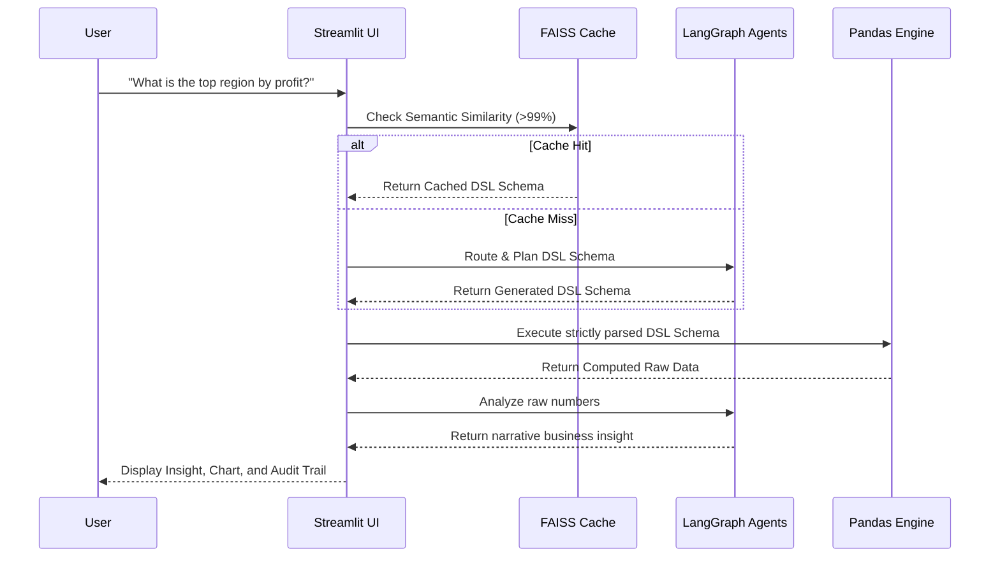
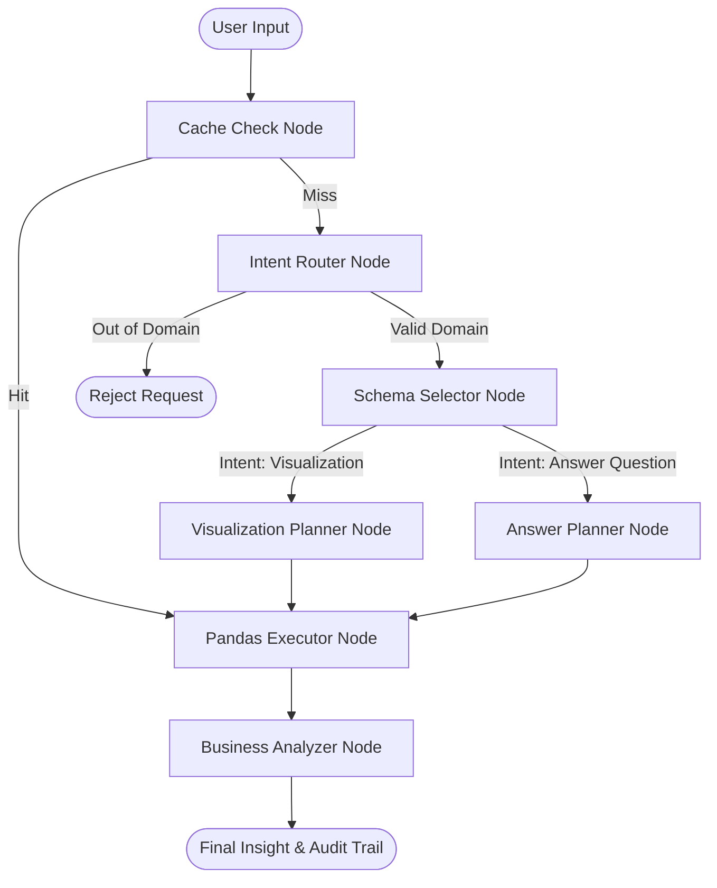

# Ask The Data: Autonomous Multi-Agent Analytics

Ask The Data is a highly reliable, autonomous multi-agent pipeline built to interact with business databases (Superstore dataset) through Natural Language. Unlike typical Text-to-SQL or Text-to-Insight AI assistants that are prone to mathematical hallucinations, this project employs a **Zero-Hallucination Architecture**. 

The LLMs act purely as "Planners" that translate natural language into a strict JSON Data Specific Language (DSL). The actual mathematical operations are delegated entirely to the deterministic Pandas engine. The AI only resumes control at the final stage to narrate the absolutely accurate numbers into business insights.

## Tech Stack
- **Interface**: Streamlit
- **Agent Orchestration**: LangGraph, LangChain
- **LLM Engine**: OpenAI (GPT-4o-mini)
- **Data Execution Engine**: Pandas
- **Visualization**: Plotly Express
- **Semantic Caching**: FAISS (Facebook AI Similarity Search), Tiktoken

## High-Level Project Flow



## LangGraph Node Architecture

The core brain of the system is a directed state graph that isolates reasoning into specialized agents to save tokens and maximize accuracy.



## About the Dataset
This project uses a tailored version of the classic **Superstore Sales Dataset**, focused on retail merchandise value, shipping, and geography.

**Example Data Row:**
| order_id | gmv | profit | quantity | category | sub_category | cost | order_date | ship_date | customer_name | segment | city | country | region | ship_mode | lon | lat |
|---|---|---|---|---|---|---|---|---|---|---|---|---|---|---|---|---|
| US-2019-118983 | 444 | 115.44 | 4 | Office Supplies | Appliances | 328.56 | 2019-11-22 | 2019-11-26 | HP-14815 | Corporate | Fort Worth | United States | Central | Standard Class | -97.3208 | 32.7254 |

### Data Dictionary
| Column Name | Description |
|---|---|
| `order_id` | Unique identifier for the transaction (String) |
| `gmv` | Gross Merchandise Value / Sales Value (Float) |
| `profit` | Profit generated from the transaction (Float) |
| `quantity` | Number of items purchased in a single transaction (Integer) |
| `category` | Main product category (e.g. Technology, Furniture) (String) |
| `sub_category` | Specific product sub-category (String) |
| `cost` | Procurement cost or Capital Expense (Float) |
| `order_date` | Date the order was placed (Date) |
| `ship_date` | Date the product was shipped (Date) |
| `customer_name` | Full name of the customer (String) |
| `segment` | Customer market segment (e.g. Corporate, Consumer) (String) |
| `city` | Shipping destination city (String) |
| `country` | Shipping destination country (String) |
| `region` | Geographic region (e.g. Central, East, West) (String) |
| `ship_mode` | Mode of shipping (String) |
| `lon` / `lat` | Longitude and Latitude coordinates (Float) |

## Codebase Walkthrough (For Developers)
To understand the architecture and execution flow of this project, we recommend reviewing the codebase in the following order:

1. **`main.py`**: The entry point of the Streamlit application. This file handles the UI initialization and user input capture.
2. **`src/utils/chat_handler.py`**: Manages the chat interaction loop. It routes user inputs to the LangGraph agents and renders the final text and graphical responses to the UI.
3. **`src/agents/graph.py`**: Defines the core `StateGraph` (LangGraph) architecture. It contains the routing logic that directs queries to specialized nodes based on the detected user intent.
4. **`src/agents/nodes.py`**: Contains the specific implementation for each graph node (e.g., Router, Selector, Planner, Analyzer). This is where the LLM is invoked to construct the Domain Specific Language (DSL) schema.
5. **`src/models/*.py`**: Defines the Pydantic schemas (such as `DataQuerySchema` and `VisualizationSchema`). These schemas are utilized by the Planner nodes to enforce strict, structured JSON outputs from the LLM.
6. **`src/utils/query_engine.py`**: The execution engine. Once the LLM generates a schema, this module executes the deterministic Pandas operations (filtering, aggregating, sorting) to compute the actual data, preventing mathematical hallucinations.
7. **`src/utils/chart_builder.py`**: Transforms the processed data from `query_engine.py` into interactive Plotly visualizations for visualization intents.
8. **`src/prompts/templates/` & `src/prompts/manager.py`**: Contains the system prompts and instructions provided to each specialized agent.

## How to Run

1. Clone this repository.
2. Install the `uv` package manager (Sangat direkomendasikan karena lebih cepat dari standar `pip`).
3. Install the required dependencies:
   ```bash
   uv pip install -r requirements.txt
   ```
4. Create a `.env` file in the root directory and add your keys:
   ```env
   OPENAI_API_KEY=sk-proj-YOUR_API_KEY
   LANGCHAIN_TRACING_V2="true"
   LANGCHAIN_API_KEY=YOUR_LANGSMITH_KEY
   LANGCHAIN_PROJECT="Ask The Data"
   ```
5. Run the Streamlit application:
   ```bash
   uv run streamlit run main.py
   ```

## Future Improvements
1. **Cloud Redis Semantic Cache**: Migrate from the local FAISS in-memory cache to a distributed Redis Vector Store to support serverless deployment (e.g. on AWS or Heroku) where RAM instances are ephemeral.
2. **PostgreSQL/BigQuery Executor**: Replace the Pandas Executor Node with a secure SQL dialect executor to handle billion-row datasets without loading everything into RAM.
3. **Conversational Memory Window**: Upgrade the current `MemorySaver` checkpoint to a summarized rolling window memory so the AI can remember past interactions infinitely without blowing up the OpenAI token limit context window.
